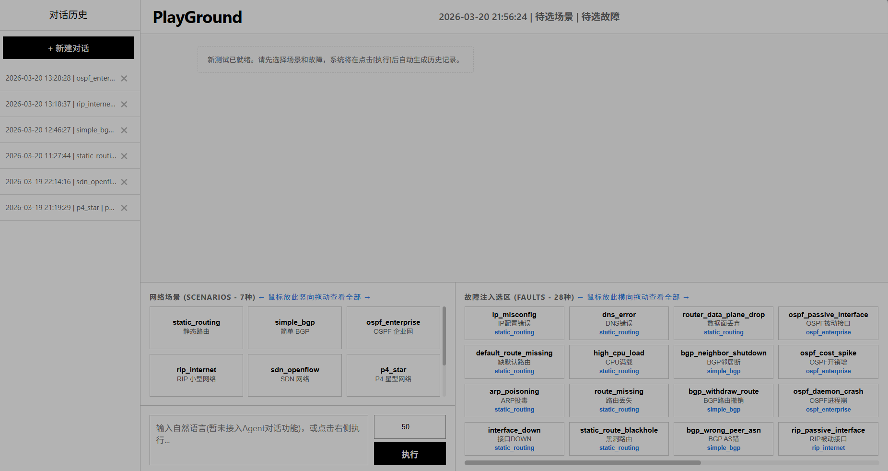

# Playground Of Automatic NetWork Trouble-Shooting and Benchmark



> **PlayGround** 是一个基于大语言模型（LLM）与 Agent 架构构建的**自动化网络故障诊断智能体与基准测试平台**。本项目集成了多种底层网络模拟环境，支持自动化故障注入、Agent 观测与诊断、以及全自动的主客观基准测试报告生成。具有“极客风”的流式终端 UI 界面，实现了“所点即所得”的无缝交互体验。

## 💡 设计架构

本系统采用前后端分离与高度模块化的 Agent 架构设计，核心工作流如下：

1. **前端交互层 (Flask + SocketIO)**：纯原生 HTML/JS/CSS 打造的“黑白灰极客终端”，采用 WebSocket 实现全双工通信，提供极低延迟的“打字机”流式日志渲染，防止因为阻塞导致的 UI 卡死。
2. **场景与故障注入层 (Fault Injector)**：内置 6 种主流网络拓扑与 28 种复杂网络故障。通过一键配置，自动化生成底层的 Docker/OVS/FRR/BMv2 环境并实施精准的故障注入。
3. **Agent 诊断引擎 (LangGraph + MCP)**：基于 ReAct 范式的排障智能体。Agent 可通过 Model Context Protocol (MCP) 调用海量工具（如 Ping、Traceroute、查看流表、检查 BGP/OSPF 邻居等），模拟真实网络工程师的排障思维链（Thought-Action-Observation）。
4. **自动评估系统 (Judge Agent)**：排障结束后，独立的裁判智能体将对排障 Agent 的思维链、工具调用次数、Token 消耗以及根因定位准确率进行主观与客观的双重打分，并自动生成 Markdown 评估报告。

## 📁 核心模块介绍

本项目采用 `src-layout` 标准源码布局，核心目录结构及功能如下：
### 0. `KlonetAPI` (Klonet 网络仿真平台 API)
项目中网络拓朴的创建、删除和修改均由 Klonet 平台管理。通过 KlonetAPI 与 Klonet 平台交互。

### 1. `app.py` (顶层交互界面)
项目的前端与路由核心。基于 Flask 与 Flask-SocketIO 构建，负责渲染包含“网络场景选择”、“故障注入网格”、“历史会话管理”和“流式终端打字机”的交互式 Web 页面。内置了强大的全局终端标准输出拦截器（Interceptor），无损捕获后台多线程 Agent 的思维链并实时推送至前端。

### 2. `orchestrator.py` (全栈指挥官)
系统的中枢神经。负责组织和编排整个测试生命周期：
* 调用底层 API 部署指定的网络环境配置。
* 唤起 `fault_injector` 执行故障下发。
* 组装网络拓扑环境上下文，并拉起 `Agent` 工作流图谱进行诊断。
* 回收环境资源并输出最终的诊断 Markdown 报告。

### 3. `agent/` (智能体大脑)
基于大语言模型构建的决策中心：
* `react_agent.py`：负责执行网络故障诊断任务的 ReAct 智能体，具备规划、执行工具和反思的能力。
* `judge_agent.py`：负责对诊断过程进行事后评价、打分的裁判智能体。
* `main.py`：利用 LangGraph 将多个 Agent 节点串联为具有状态管理的有向无环图（DAG）。

### 4. `fault_injector/` (故障注入池)
全面且高度可扩展的故障注入模块：
* 包含 3 大分类：主机故障（`injector_host.py`）、链路故障（`injector_tc.py`，基于 Linux TC）、服务级故障（`injector_service.py`，针对 OVS/BMv2/FRR 等）。
* 支持总计 **28种** 细粒度网络故障（如 OSPF 开销激增、BGP 路由撤销、SDN 控制器崩溃、P4 流表丢弃等）。

### 5. `net_env/` (网络场景基座)
存放用于构建基础网络拓扑的 Python 脚本与 P4 源码，共支持 **6 大经典场景**：
* `static_routing` (静态路由)
* `simple_bgp` (简单 BGP)
* `ospf_enterprise` (OSPF 企业网)
* `rip_internet` (RIP 小型网络)
* `sdn_openflow` (SDN OpenFlow 架构)
* `p4_star` (P4 星型可编程网络)

### 6. `service/` (服务与工具集成)
Agent 的“手和眼”，包含对网络平台的控制接口：
* `/klonet`: 结合 Klonet 平台的底层控制 API，用于操作节点、链路、流量及防火墙。
* `/mcp_server`: 五大类供 Agent 调用的标准化工具集（Host, Link, Switch, Router/FRR, Controller），使 LLM 能够安全、规范地获取网络状态。

### 7. `utils/` (通用组件)
* `llm_models.py`: 大语言模型调用接口的统一封装适配。

## 🚀 快速启动

1. 克隆仓库至本地：
```bash
git clone [https://github.com/你的用户名/PlayGround.git](https://github.com/你的用户名/PlayGround.git)
cd PlayGround
git checkout playground
```

2. 安装依赖：

```bash
pip install -e .
```

3. 启动平台：

```bash
python src/app.py
```
